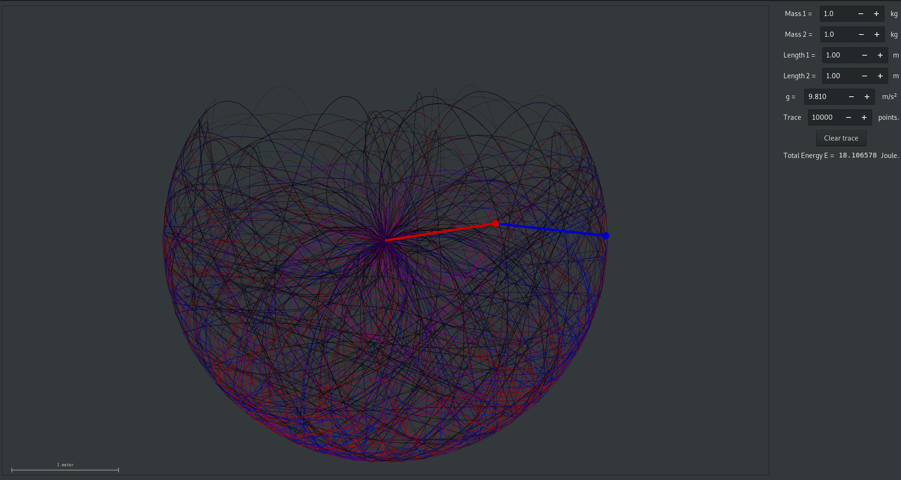

# Double pendulum in c++

Double pendulum visualization in c++ using the cross platform graphics lib "gtkmm".

## The Physics
The color of the trace indicates the anglular velocity of each pendulum in that moment(Red value: First pendulum, blue value: second pendulum).

I tried to calculate the equation myself by deriving them in the Lagrange-formalism.
After failing at that two times (or not be patient enough to simplifiy everything with trigonometric 
identities), I ended up using formulas somebody in the internet derived with an equation solver.

I came up with:
$$ \ddot{\varphi}_1 = \frac{-\frac{m_2}{m_1+m_2}\dot\varphi_1^2 \sin(\varphi_1 - \varphi_2)\cos(\varphi_1 - \varphi_2)+ \frac{m_2}{m_1+m_2} \frac{g}{l_1}\sin(\varphi_2)\cos(\varphi_1 - \varphi_2)- \frac{m_2}{m_1+m_2}\frac{l_2}{l_1}\dot\varphi_2^2\sin(\varphi_1 - \varphi_2)-\frac{g}{l_1}\sin(\varphi_1)}{1-\frac{m_2}{m_1+m_2} \cos (\varphi_1 - \varphi_2)} $$
$$ \ddot{\varphi}_2 = \frac{\frac{m_2}{m_1+m_2}\dot\varphi_2^2 \sin(\varphi_1 - \varphi_2)\cos(\varphi_1 - \varphi_2)+  \frac{g}{l_2}\sin(\varphi_1)\cos(\varphi_1 - \varphi_2)+ \frac{l_1}{l_2}\dot\varphi_1^2\sin(\varphi_1 - \varphi_2)-\frac{g}{l_2}\sin(\varphi_2)}{1-\frac{m_2}{m_1+m_2} \cos (\varphi_1 - \varphi_2)} $$

But [these](https://www.myphysicslab.com/pendulum/double-pendulum-en.html) people worked something different out (which maybe can be rearanged to equal my solution).

## The code
There are some obvious improvements to be done, they are coming.

## Starting the hole thing
I only tried to build it on linux. You need to have the *gnu compiler collection* and *make* (both probably allready installed under linux). Install [gtkmm](https://www.gtkmm.org/en/download.html) (also installed on most linux-systems), too. 

### Building 
In the main directory of this repo:
~~~
$ make
~~~

### Starting
With the right path, after building:
~~~
$ ./main
~~~

## Port to other operating systems
All software I used is available on Windows, Mac and all Linux-Distributions. So for non-linux users it should not be that hard to port the whole thing, let me know if you do something in that direction.